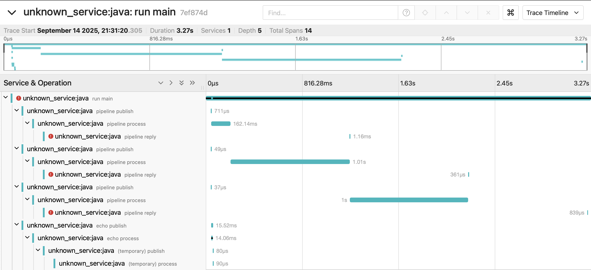

# NATS - Scala Client

A Scala client for the [NATS messaging system](https://nats.io) built by wrapping
the current [NATS.java](https://github.com/nats-io/nats.java) implementation.

## Table of Contents

* [Installation](#installation)
* [Basic Usage](#basic-usage)
* [OpenTelemetry](#opentelemetry)
* [Extra](#extra)


## Installation

### SBT

```scala
libraryDependencies += "io.github.alixba" %% "nats-scala-core" % "0.0.5"
```

### Mill

```scala
override def mvnDeps: Simple[Seq[Dep]] = Seq(
  mvn"io.github.alixba::nats-scala-core:0.0.5"
)
```

## Basic Usage

Use `io.nats.scala.core.Nats` to create a NATS connection.
See the [NATS.java](https://github.com/nats-io/nats.java) for more information.

```scala
import cats.effect.IO
import cats.effect.IOApp
import io.nats.client.Options
import io.nats.scala.core.Nats

import scala.concurrent.duration.DurationInt

object Main extends IOApp.Simple {

  override def run: IO[Unit] = {
    // the same you would do initializing the java library
    val natsUrl = "nats://localhost:4222"
    val options = Options.Builder().server(natsUrl).build()

    // initialize the NATS connection
    Nats.connect[IO](options).use { nats =>
      (for {
        // create and start the echo dispatcher/subscription
        dispatcher1 <- nats.dispatcher(message =>
          message.replyTo match {
            case Some(replyTo) => nats.publish(replyTo, message.data)
            case None          => IO.unit
          }
        )
        _ <- dispatcher1.subscribe("echo")
      } yield nats).use { nats =>
        for {
          // create the stream and its cancelling action. This is an infinite
          // stream and we might want to mark it uncancellable to make sure
          // we process all the messages on the underlying NATS dispatcher.
          // run the cancel action to properly drain the dispatcher and end
          // the stream when all elements are consumed. Mark the stream as
          // uncancellable to make sure it doesn't get cancelled.
          (stream, cancel) <- nats.stream("pipeline")
          streamF = stream
            .evalMap(message =>
              IO.println(s"Streamed Message{subject=${message.subject}, data=${String(message.data)}}")
            )
            // .take(n) to make it finite at some point
            .compile
            .drain
            .uncancelable

          // publish/request with messaging instumentation
          _ <- nats.publish(subject = "pipeline", data = "alice1".getBytes())
          _ <- nats.publish(subject = "pipeline", data = "alice2".getBytes())
          _ <- nats.publish(subject = "pipeline", data = "alice3".getBytes())
          response <- nats.request(subject = "echo", data = "bob".getBytes())
          _ <- IO.println(s"Received Message{subject=${response.subject}, data=${String(response.data)}}")

          // wait until we send & receive all messages from the server
          _ <- IO.sleep(100.millis)

          // either wait for the SIGTERM to cancel the infinite stream
          // or wait for the stream to finish in case it has been made finite
          // with .take(n) or similar
          _ <- IO.race(IO.never.onCancel(cancel), streamF)
        } yield ()
      }
    }
  }

}
```

Output
```
Received Message{subject=_INBOX.K44MZNVha5XvwTkq14N3Qt.K44MZNVha5XvwTkq14N3gZ, data=bob}
Streamed Message{subject=pipeline, data=alice1}
Streamed Message{subject=pipeline, data=alice2}
Streamed Message{subject=pipeline, data=alice3}
```

## OpenTelemetry

Use `io.nats.scala.otel.TelemetryNats` to create an instrumented NATS connection.
See the [Java OpenTelemetry Instrumentation](https://github.com/open-telemetry/opentelemetry-java-instrumentation) for more information.

### SBT

```scala
javaOptions += "-Dcats.effect.trackFiberContext=true"
libraryDependencies += "io.github.alixba" %% "nats-scala-otel" % "0.0.5"
```

### Mill

```scala
override def forkArgs: Simple[Seq[String]] = Seq(
  "-Dcats.effect.trackFiberContext=true"
)

override def mvnDeps: Simple[Seq[Dep]] = Seq(
  mvn"io.github.alixba::nats-scala-otel:0.0.5"
)
```

### Example

```scala
import cats.effect.IO
import cats.effect.IOApp
import cats.mtl.Local
import cats.syntax.option.none
import io.nats.client.Options
import io.nats.scala.core.Message
import io.nats.scala.core.MessageHandler
import io.nats.scala.otel.TelemetryMessage
import io.nats.scala.otel.TelemetryNats
import org.typelevel.otel4s.context.LocalProvider
import org.typelevel.otel4s.oteljava.OtelJava
import org.typelevel.otel4s.oteljava.context.Context
import org.typelevel.otel4s.oteljava.context.IOLocalContextStorage
import org.typelevel.otel4s.trace.StatusCode
import org.typelevel.otel4s.trace.Tracer

import scala.concurrent.duration.DurationInt

object Main extends IOApp.Simple {

  override def run: IO[Unit] = {
    // the same you would do initializing the java library
    val natsUrl = "nats://localhost:4222"
    val options = Options.Builder().server(natsUrl).build()

    // interoperability java-scala instrumentations
    // requires cats.effect.trackFiberContext=true
    given lp: LocalProvider[IO, Context] = IOLocalContextStorage.localProvider[IO]

    (for {
      // assuming that you have the proper dependencies for the auto configuration
      // and otel.java.global-autoconfigure.enabled=true
      otelJava <- OtelJava.autoConfigured[IO]()

      // initialize an instrumented NATS connection
      given Tracer[IO] <- otelJava.tracerProvider.get("nats.service").toResource
      given Local[IO, Context] <- lp.local.toResource

      // initialize the NATS connection with instrumentation
      nats <- TelemetryNats.connect[IO](otelJava.underlying, options)
    } yield (Tracer[IO], nats)).use { (tracer, nats) =>
      // Reply to incoming messages with a replyTo, marking the current
      // span as error if there is no one to reply to. Tracing context
      // propagated from remote if any.
      val reply: MessageHandler[IO] = (message: Message) =>
        message.replyTo match {
          case Some(replyTo) => nats.publish(replyTo, message.data)
          case None          => tracer.currentSpanOrNoop.flatMap(_.setStatus(StatusCode.Error))
        }

      (for {
        // create and start the echo dispatcher/subscription
        dispatcher1 <- nats.dispatcher(reply)
        _ <- dispatcher1.subscribe("echo")
      } yield nats).use { nats =>
        tracer.rootSpan("run main").surround {
          for {
            // create the stream and its cancelling action. This is an infinite
            // stream and we might want to mark it uncancellable to make sure
            // we process all the messages on the underlying NATS dispatcher.
            // run the cancel action to properly drain the dispatcher and end
            // the stream when all elements are consumed. Mark the stream as
            // uncancellable to make sure it doesn't get cancelled.
            (stream, cancel) <- nats.stream("pipeline")
            streamF = stream
              .map {
                // you can access the current span context to use later.
                case message: TelemetryMessage => (message, message.spanContext)
                case message                   => (message, none)
              }
              .evalTap(_ => IO.sleep(1.second))
              .evalMap {
                case (message, Some(context)) =>
                  tracer.childScope(context)(
                    tracer
                      .span(s"${message.subject.value} reply")
                      .surround(reply(message))
                  )
                case (message, _) => tracer.rootScope(reply(message))
              }
              // .take(n) to make it finite at some point
              .compile
              .drain
              .uncancelable

            // publish/request with messaging instumentation
            _ <- nats.publish(subject = "pipeline", data = "alice1".getBytes())
            _ <- nats.publish(subject = "pipeline", data = "alice2".getBytes())
            _ <- nats.publish(subject = "pipeline", data = "alice3".getBytes())
            _ <- nats.request(subject = "echo", data = "bob".getBytes())

            // wait until we send & receive all messages from the server
            _ <- IO.sleep(100.millis)

            // either wait for the SIGTERM to cancel the infinite stream
            // or wait for the stream to finish in case it has been made finite
            // with .take(n) or similar
            _ <- IO.race(IO.never.onCancel(cancel), streamF)
          } yield ()
        }
      }
    }
  }

}

```

### Jaeger



### TelemetryError Listener

`TelemetryErrorListener` provides logging through `log4cats` over error in NATS message processing. Add it to your `Options` if you want to replace the default NATS logging system with this integration.

## Extra

### SBT

```scala
libraryDependencies += "io.github.alixba" %% "nats-scala-extra" % "0.0.5"
```

### Mill

```scala
override def mvnDeps: Simple[Seq[Dep]] = Seq(
  mvn"io.github.alixba::nats-scala-extra:0.0.5"
)
```

### Error Message

Since there is no out of the box support to handle error in processing, the extra module offers a way to propagate error using headers as a support.

```scala
import cats.effect.IO
import cats.effect.IOApp
import io.nats.client.Options
import io.nats.scala.core.Headers
import io.nats.scala.core.Message
import io.nats.scala.core.Nats
import io.nats.scala.extra.syntax.headers.toHeadersOps
import io.nats.scala.extra.syntax.message.toMessageOps

object Main extends IOApp.Simple {

  def printMessage(message: Message): String = s"""
    Message{
      headers=${message.headers.map.map { case (k, v) => s"${k.value.toString} -> [${v.map(_.value).mkString(",")}]" }.mkString}
      hasError=${message.hasError}
      errorCode=${message.getErrorCode.map(_.toString).getOrElse("")}
      errorText=${message.getErrorText.map(_.value).getOrElse("")}
    }
  """

  override def run: IO[Unit] =
    Nats.connect[IO](Options.builder().build()).use { connection =>
      connection.stream("subject").flatMap { case (stream, cancel) =>
        val streamF = stream
          .evalTap { message =>
            message.replyTo match {
              case Some(replyTo) if message.data.isEmpty =>
                connection.publish(replyTo, Headers.empty.withError(400, "Bad Request"), Array.emptyByteArray)
              case Some(replyTo) =>
                connection.publish(replyTo, "Success".getBytes())
              case None =>
                IO.unit
            }
          }
          .compile
          .drain

        for {
          _ <- streamF.uncancelable.start
          error <- connection.request("subject", Array.emptyByteArray)
          _ <- cancel
          _ <- IO.println(printMessage(error))
        } yield ()
      }
    }

}
```

Output
```
Message{
  headers=x-nats-scala-error -> [400,Bad Request]
  hasError=true
  errorCode=400
  errorText=Bad Request
}
```

### Lame Duck Mode Listener

Use the provided `NatsLameDuckModeListener` to trigger a drain of the current connection and a reconnect whenever the server notifies the client that the connection will be closed. By default, the server will close the connection and the client will only try to reconnect at that point, buffering outgoing messages.

```scala
import io.nats.client.Options
import io.nats.scala.extra.NatsLameDuckModeListener

Options.builder().connectionListener(NatsLameDuckModeListener.create()).build()
```
